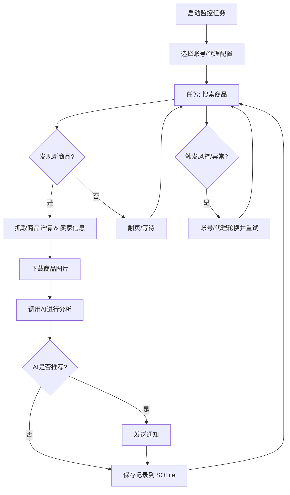

# 闲鱼智能监控系统（进化版）

[中文] ｜ [English](README_EN.md)

本项目 fork 自 [Usagi-org/ai-goofish-monitor](https://github.com/Usagi-org/ai-goofish-monitor)，在原有的 Playwright + AI 闲鱼监控能力之上做了持续改造：把主存储从 JSON/JSONL 迁移到 SQLite、把黑名单从"结果过滤"提前到"爬取阶段拦截"、通知渠道支持逐个开关、结果列表增加智能排序、AI 调用遇到限流会自动退避重试。核心定位不变——多任务并发监控闲鱼商品，配合多模态 AI 分析和 Web 管理界面。

## 核心特性

- **Web 可视化管理**：任务、账号、AI 判断标准、运行日志、监控结果全部在浏览器里操作，不用碰命令行
- **AI 判断商品**：用自然语言描述需求即可生成分析标准，多模态模型会结合图文判断商品是否符合预期
- **多任务并发**：每个任务独立配置关键词、价格区间、筛选条件、Prompt 和绑定账号，互不影响
- **精细化筛选**：包邮、新发布时间范围、省/市/区三级地区筛选
- **两级黑名单**：全局黑名单对所有任务生效，任务黑名单只影响单个任务；命中的商品在爬取阶段就被拦下，不会进详情抓取、不落库、也不会触发通知
- **多渠道即时通知**：ntfy.sh、企业微信、Bark、Telegram、邮件(SMTP)、Webhook，每个渠道可单独开关，不用全开或全关
- **结果智能排序**：AI 推荐的商品优先展示，其余按价格从低到高排列
- **定时调度**：Cron 表达式配置周期性抓取
- **账号与代理轮换**：多账号管理、任务可绑定指定账号，代理池轮换配合失败重试降低被风控概率
- **AI 限流自愈**：遇到 429 会按指数退避自动重试，无需人工干预
- **Docker 一键部署**：内置 Chromium，开箱即用

## 截图


## 🐳 Docker 部署（推荐）

```bash
git clone https://github.com/LinBlink/advanced-ai-goofish-monitor && cd advanced-ai-goofish-monitor
cp .env.example .env
vim .env # 填写相关配置项
docker compose up -d
docker compose logs -f app
docker compose down
```

如果镜像无法访问或下载速度慢，可尝试使用加速：
```bash

docker pull ghcr.nju.edu.cn/usagi-org/ai-goofish:latest
docker tag ghcr.nju.edu.cn/usagi-org/ai-goofish:latest ghcr.io/usagi-org/ai-goofish:latest
docker compose up -d

```

- 默认 Web UI 地址：`http://127.0.0.1:8000`
- Docker 镜像已内置 Chromium，无需宿主机额外安装浏览器。
- `docker-compose.yaml` 默认仍拉取上游镜像 `ghcr.io/usagi-org/ai-goofish:latest`（本 fork 暂未独立发布镜像）；如果需要包含本仓库改动的镜像，请参考下方“本地构建镜像”自行构建。
- 更新镜像：`docker compose pull && docker compose up -d`
- 如果你修改了 `.env` 中的 `SERVER_PORT`，请同步更新 `docker-compose.yaml` 里的端口映射。
- `docker-compose.yaml` 默认会把 SQLite 主库挂载到 `./data:/app/data`，数据库文件默认为 `data/app.sqlite3`
- 目前默认持久化这些目录：
    - `data/`  SQLite 主存储（任务、结果、价格历史）
    - `state/`  登录状态 cookie 文件
    - `prompts/`  任务提示词
    - `logs/`  运行日志
    - `images/`  商品图片与任务临时图片目录
    - `config.json`、`jsonl/`、`price_history/`  首次升级到 SQLite 时用于兼容导入的旧数据源

### 本地构建镜像

如果想用上本仓库的最新改动而不是等上游镜像更新，可以自己构建：

```bash
docker build -f Dockerfile.release -t ai-goofish-monitor:local .
APP_IMAGE=ai-goofish-monitor:local docker compose up -d
```

`Dockerfile.release` 默认基于上游发布的 `ghcr.io/usagi-org/ai-goofish-base:latest` 基础镜像（内置 Playwright/Chromium 等系统依赖），只重新构建前端和应用代码层，构建速度较快。

### 数据存储与迁移

- 当前在线主存储为 SQLite，默认路径 `data/app.sqlite3`
- 可通过环境变量 `APP_DATABASE_FILE` 自定义数据库路径；Docker 默认设置为 `/app/data/app.sqlite3`
- 应用启动时会自动建库建表，并尝试从旧的 `config.json`、`jsonl/`、`price_history/` 导入一次历史数据
- `state/`、`prompts/`、`logs/`、`images/` 仍然是文件系统目录，不在 SQLite 中
- 商品图片会临时落到 `images/task_images_<task_name>/`，任务结束后默认会清理
- 首次升级完成并确认 `data/app.sqlite3` 中数据正确后，可视部署方式决定是否继续保留旧的 `config.json`、`jsonl/`、`price_history/` 挂载

### 最少配置

| 变量 | 说明 | 必填 |
|------|------|------|
| `OPENAI_API_KEY` | AI 模型 API Key | 是 |
| `OPENAI_BASE_URL` | OpenAI 兼容接口地址 | 是 |
| `OPENAI_MODEL_NAME` | 支持图片输入的模型名称 | 是 |
| `WEB_USERNAME` / `WEB_PASSWORD` | Web UI 登录账号密码，默认 `admin/admin123` | 否 |

其余配置见下方“配置说明”。


### 第一次使用

1. 打开默认 Web UI `http://127.0.0.1:8000` 并登录。
2. 进入“闲鱼账号管理”，使用 [Chrome 扩展](https://chromewebstore.google.com/detail/xianyu-login-state-extrac/eidlpfjiodpigmfcahkmlenhppfklcoa) 导出并粘贴闲鱼登录态 JSON。
3. 登录态文件会保存到 `state/` 目录，例如 `state/acc_1.json`。
4. 回到“任务管理”，创建任务并绑定账号后即可运行。

### 创建第一个任务

- `AI判断`：填写“详细需求”，提交后会弹出独立进度弹窗，后台异步生成分析标准。
- `关键词判断`：填写关键词规则，任务会直接创建，不经过 AI 生成流程。
- `区域筛选`：已改为省 / 市 / 区三级选择器，数据基于闲鱼页面抓取快照内置。


## 用户使用说明

<details>
<summary>点击展开 Web UI 功能说明</summary>

### 任务管理

- 支持 AI 创建、关键词规则、价格范围、新发布范围、区域筛选、账号绑定、定时规则。
- AI 任务创建是后台 job 流程，提交后会打开单独的进度弹窗。
- 区域筛选会显著缩小结果集，默认留空。

### 账号管理

- 支持导入、更新、删除闲鱼账号登录态。
- 每个任务可指定账号，也可不绑定并交给系统自动选择。
- 启用「账号轮换」后，系统会在 `ACCOUNT_STATE_DIR`（默认 `state/`）下存放的多个账号登录态文件（`*.json`）之间自动切换，降低单账号被风控的概率。

### 结果查看与运行日志

- 结果页和导出功能现在从 SQLite 查询，不再直接扫描 `jsonl` 文件。
- 支持按爬取时间、发布时间、价格（升/降序）、关键词命中数排序，以及“智能排序”（AI 推荐商品优先，其余按价格从低到高）。
- 日志页按任务展示运行过程，便于排查登录态失效、风控和 AI 调用问题。

### 系统设置

- 可查看系统状态、编辑 Prompt、调整代理与轮换相关配置。
- “全局黑名单”标签页维护跨任务生效的爬取黑名单：每行一个关键词，支持逗号分隔，也支持 `re:` 前缀的正则规则（如 `re:\b(二手|全新)\b`）。命中规则的商品在爬取阶段即被跳过，不会进入详情抓取、结果保存或通知流程。

</details>


## 开发者开发

### 环境要求

- Python 3.10+
- Node.js + npm（本地验证 `Node v20.18.3` 可完成前端构建）
- Playwright CLI 与 Chromium，首次运行前建议执行 `python3 -m pip install playwright && python3 -m playwright install chromium`
- Chrome / Edge 浏览器（Linux 环境也可使用 Chromium；`start.sh` 会先检查浏览器是否存在）

```bash
git clone https://github.com/LinBlink/advanced-ai-goofish-monitor
cd advanced-ai-goofish-monitor
cp .env.example .env
```

### 一键启动

```bash
chmod +x start.sh
./start.sh
```

`start.sh` 会先检查 Playwright CLI 和浏览器前置条件；在前置条件满足后自动安装项目依赖、构建前端、复制构建产物并启动后端。

### 手动启动

```bash
# 后端
python -m src.app
# 或
uvicorn src.app:app --host 0.0.0.0 --port 8000 --reload

# 前端
cd web-ui
npm install
npm run dev
```

- FastAPI 启动时会自动初始化 SQLite，并在首次启动时尝试导入旧的 `config.json/jsonl/price_history`
- `spider_v2.py` 默认从 SQLite 读取任务；只有显式传入 `--config <path>` 时才会走 JSON 配置兼容模式
- 默认数据库路径为 `data/app.sqlite3`
- Vite 开发服务器会将 `/api`、`/auth`、`/ws` 代理到 `http://127.0.0.1:8000`。
- `npm run build` 先生成 `web-ui/dist/`，`start.sh` 再复制到仓库根目录 `dist/`。
- FastAPI 负责提供根目录 `dist/index.html` 和 `dist/assets/`。
- `./start.sh` 默认输出访问地址 `http://localhost:8000` 和 API 文档 `http://localhost:8000/docs`。

### 测试与校验

```bash
PYTEST_DISABLE_PLUGIN_AUTOLOAD=1 pytest
cd web-ui && npm run build
```

### 任务创建 API

<details>
<summary>点击展开 API 行为说明</summary>

- `POST /api/tasks/generate`
  - `decision_mode=ai`：返回 `202` 和 `job`，需要继续轮询进度。
  - `decision_mode=keyword`：直接返回已创建任务。
- `GET /api/tasks/generate-jobs/{job_id}`：查询 AI 任务生成进度。
- `POST /auth/status`：校验 Web UI 登录凭据。

</details>

## 配置说明

<details>
<summary>点击展开常用配置项</summary>

### AI 与运行时

- `OPENAI_API_KEY` / `OPENAI_BASE_URL` / `OPENAI_MODEL_NAME`：AI 模型接入必填项。
- `PROXY_URL`：为 AI 请求单独指定 HTTP/SOCKS5 代理。
- `RUN_HEADLESS`：是否以无头模式运行爬虫；Docker 中应保持 `true`。
- `SERVER_PORT`：后端监听端口，默认 `8000`。
- `LOGIN_IS_EDGE`：本地环境可切换为 Edge 内核；Docker 镜像未内置 Edge，容器内会固定使用 Chromium。
- `PCURL_TO_MOBILE`：是否将 PC 商品链接转换为移动端链接。

### 通知

- 每个渠道都有独立的 `*_ENABLED` 开关（如 `NTFY_ENABLED`、`BARK_ENABLED`、`EMAIL_ENABLED`），默认 `true`；也可以在 Web UI 的“系统设置 -> 通知设置”页面直接勾选/取消。
- `NTFY_TOPIC_URL`
- `GOTIFY_URL` / `GOTIFY_TOKEN`
- `BARK_URL`
- `WX_BOT_URL`
- `TELEGRAM_BOT_TOKEN` / `TELEGRAM_CHAT_ID` / `TELEGRAM_API_BASE_URL`
- `SMTP_HOST` / `SMTP_PORT` / `SMTP_USERNAME` / `SMTP_PASSWORD` / `SMTP_FROM_ADDRESS` / `SMTP_TO_ADDRESS` / `SMTP_USE_SSL`：邮件通知，`SMTP_HOST`、`SMTP_USERNAME`、`SMTP_PASSWORD`、`SMTP_TO_ADDRESS` 需同时配置才会启用
- `WEBHOOK_*`

### 账号与代理轮换

- `ACCOUNT_ROTATION_ENABLED`：是否开启账号轮换（全局开关，开启后对所有任务生效）。
- `ACCOUNT_ROTATION_MODE`：`per_task`（每个任务固定使用一个账号）或 `on_failure`（仅当账号触发风控时切换）。
- `ACCOUNT_STATE_DIR`：存放账号登录态文件的目录，默认 `state`，需放入多个 `*.json` 账号态文件才会真正轮换。
- `ACCOUNT_ROTATION_RETRY_LIMIT` / `ACCOUNT_BLACKLIST_TTL`：轮换重试次数与被拉黑账号的冷却时长（秒）。
- `PROXY_ROTATION_ENABLED` / `PROXY_ROTATION_MODE` / `PROXY_POOL` / `PROXY_ROTATION_RETRY_LIMIT` / `PROXY_BLACKLIST_TTL`：代理轮换的开关、模式、代理池（逗号分隔）与重试/冷却参数。

#### 如何启用轮换

1. 在 Web UI 的「系统设置 → 账号与代理轮换」中打开对应开关并保存。
   - 账号轮换需要先准备多个账号登录态：通过浏览器扩展导出每个账号的登录态 JSON，放入 `ACCOUNT_STATE_DIR`（`state/`）目录。若该目录没有任何 `*.json` 文件，即使开启开关也会自动退回单一登录态（控制台会给出提示）。
   - 代理轮换需要在 `PROXY_POOL` 中填写至少一个代理地址（如 `http://127.0.0.1:7890,socks5://127.0.0.1:1080`），留空则不启用代理。
2. 保存后设置会写入 `.env` 并立即生效；下次任务运行即按配置进行轮换。

> 注意：早期版本中账号轮换仅在「不存在根登录态」时才会生效，登录后（存在 `xianyu_state.json`）开关会被忽略。现已修复——只要显式开启 `ACCOUNT_ROTATION_ENABLED` 且 `ACCOUNT_STATE_DIR` 下存在账号文件，就会优先使用账号池轮换，不受根登录态影响。

### 失败保护

- `TASK_FAILURE_THRESHOLD`
- `TASK_FAILURE_PAUSE_SECONDS`
- `TASK_FAILURE_GUARD_PATH`

完整示例见 `.env.example`。

</details>

## Web 界面认证

<details>
<summary>点击展开认证说明</summary>

- Web UI 当前使用登录页收集账号密码，并通过 `POST /auth/status` 校验。
- 登录成功后，前端会在浏览器本地保存登录状态，用于路由守卫和 WebSocket 初始化。
- 默认账号密码为 `admin/admin123`，生产环境请务必修改。

</details>

## 🚀 工作流程

下图描述了单个监控任务从启动到完成的核心处理逻辑。主服务运行于 `src.app`，按用户操作或定时调度启动一个或多个任务进程。



## 常见问题

<details>
<summary>点击展开常见问题</summary>

### AI 任务创建为什么不是立即完成？

AI 模式会先生成分析标准，再创建任务。现在该流程已改为后台 job，提交后会显示独立进度弹窗，避免表单长时间卡住。

### 区域筛选为什么默认建议留空？

区域筛选会显著减少搜索结果，适合明确只看某个区域的场景。若你先验证整体市场，建议先不填。

### 本地页面打开后提示前端构建产物不存在？

说明根目录 `dist/` 缺失。可直接执行 `./start.sh`，或先在 `web-ui/` 里执行 `npm run build`，再确认构建产物已复制到仓库根目录。

### `./start.sh` 为什么提示缺少 Playwright 或浏览器？

这是脚本的前置检查。请先安装 Playwright CLI 与 Chromium，并确保系统中可用 Chrome / Edge（Linux 环境也可用 Chromium），然后重新执行 `./start.sh`。

### AI 分析报错 `Error code: 429 - rate_limit_error` 怎么办？

说明 AI 服务商/中转站的速率限制已被触发。程序会自动按指数退避（5s/10s/20s，最长 60s）等待后重试，短暂的突发限流通常无需人工干预。如果持续大量出现：

- 降低该任务的 `ai_analysis_concurrency`（或环境变量 `AI_ANALYSIS_CONCURRENCY`，默认 `2`），减少并发请求数。
- 按服务商提示升级 Token Plan 套餐，或切换为按量付费 API。

</details>


## 致谢

<details>
<summary>点击展开致谢内容</summary>

本项目 fork 自 [Usagi-org/ai-goofish-monitor](https://github.com/Usagi-org/ai-goofish-monitor)，感谢原项目及其贡献者打下的基础，本仓库的改造均建立在此之上。

原项目在开发过程中也参考了以下项目，一并感谢：

- [superboyyy/xianyu_spider](https://github.com/superboyyy/xianyu_spider)

以及感谢LinuxDo相关人员的脚本贡献

- [@jooooody](https://linux.do/u/jooooody/summary)

以及感谢 [LinuxDo](https://linux.do/) 社区。

以及感谢 ClaudeCode/Gemini/Codex 等模型工具，解放双手 体验Vibe Coding的快乐。

</details>


## 注意事项

<details>
<summary>点击展开注意事项详情</summary>

- 请遵守闲鱼的用户协议和robots.txt规则，不要进行过于频繁的请求，以免对服务器造成负担或导致账号被限制。
- 本项目仅供学习和技术研究使用，请勿用于非法用途。
- 本项目采用 [MIT 许可证](LICENSE) 发布，按"现状"提供，不提供任何形式的担保。
- 项目作者及贡献者不对因使用本软件而导致的任何直接、间接、附带或特殊的损害或损失承担责任。
- 如需了解更多详细信息，请查看 [免责声明](DISCLAIMER.md) 文件。

</details>

## Star History

[](https://www.star-history.com/#LinBlink/advanced-ai-goofish-monitor&Date)
